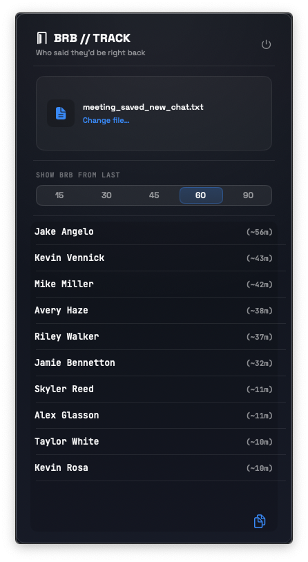

# BRBTrack

A macOS menu bar app that scans a Zoom chat transcript and shows you who's currently away.

 

---

## What it does

<table><tr><td valign="top">

During a long Zoom call it's easy to lose track of who stepped away. BRBTrack reads a saved Zoom chat log, detects BRB-style messages ("brb", "be right back", "back in 5", etc.), and presents a live list of everyone who's still out — right from your menu bar.

- Drop a Zoom `.txt` chat export onto the panel (or open it with the file picker)
- See a ranked list of absent attendees with approximate elapsed time ("~12m")
- Adjust the look-back window (default 45 minutes) to narrow or widen the scope
- Copy the list to your clipboard in one click
- Anyone who sends "I'm back" or "back!" is automatically cleared from the list

</td><td valign="top" width="300">



</td></tr></table>

---

## How it works

BRBTrack never connects to Zoom's API. It works entirely offline with the plain-text chat file Zoom can save locally.

**Parsing** — `ChatTranscriptParser` reads lines in the `HH:MM:SS From <sender> to <recipient>: <body>` format Zoom uses, with support for multi-line messages and Windows line endings.

**Detection** — `BRBDetector` runs a small scoring pass over each message body. Phrases like `brb`, `be back`, `quick shower`, or `need to grab` add points; permanent-exit phrases like `gotta go` or `signing off` subtract them. A score ≥ 3 counts as a BRB.

**Presence tracking** — `PresenceTracker` walks the full message history and maintains per-sender BRB state. "Now" is the timestamp of the last message in the file, not the machine clock, so replaying old logs gives consistent results.

---

## Installation

1. Clone the repo and open `BRBTrack.xcodeproj` in Xcode 15 or later.
2. Build and run (⌘R). The app lives entirely in the menu bar — no Dock icon.
3. To keep it running at login, right-click the menu bar icon → **Open at Login**.

> Requires macOS 13 Ventura or later (uses `MenuBarExtra`).

---

## Usage

1. In Zoom, save your meeting chat: **Chat → Save Chat** (produces a `.txt` file).
2. Click the door icon in your menu bar to open the panel.
3. Drag the `.txt` file onto the panel, or click **Open file…** to browse.
4. BRBTrack shows everyone currently away, oldest first, with how long ago they left.
5. Use the **window** slider to change how far back to look (5–120 minutes).
6. Click **Copy list** to copy the names and times to your clipboard.

---

## Project structure

```
BRBTrack/
├── BRBTrackApp.swift          # App entry point, MenuBarExtra setup
├── ContentView.swift          # Root SwiftUI view, panel sizing
├── BRBTrackPanelViews.swift   # Panel UI (drop zone, entry list, controls)
├── BRBViewModel.swift         # State, file loading, clipboard export
├── Models.swift               # ChatMessage, BRBEntry types
├── ChatTranscriptParser.swift # Zoom .txt → [ChatMessage]
├── BRBDetector.swift          # Scoring-based BRB / return-signal detection
├── PresenceTracker.swift      # Per-sender presence state + time window filter
├── DesignSystem.swift         # Colors, layout constants
└── DesignSystemUI.swift       # Reusable SwiftUI components
```

---

## License

MIT
